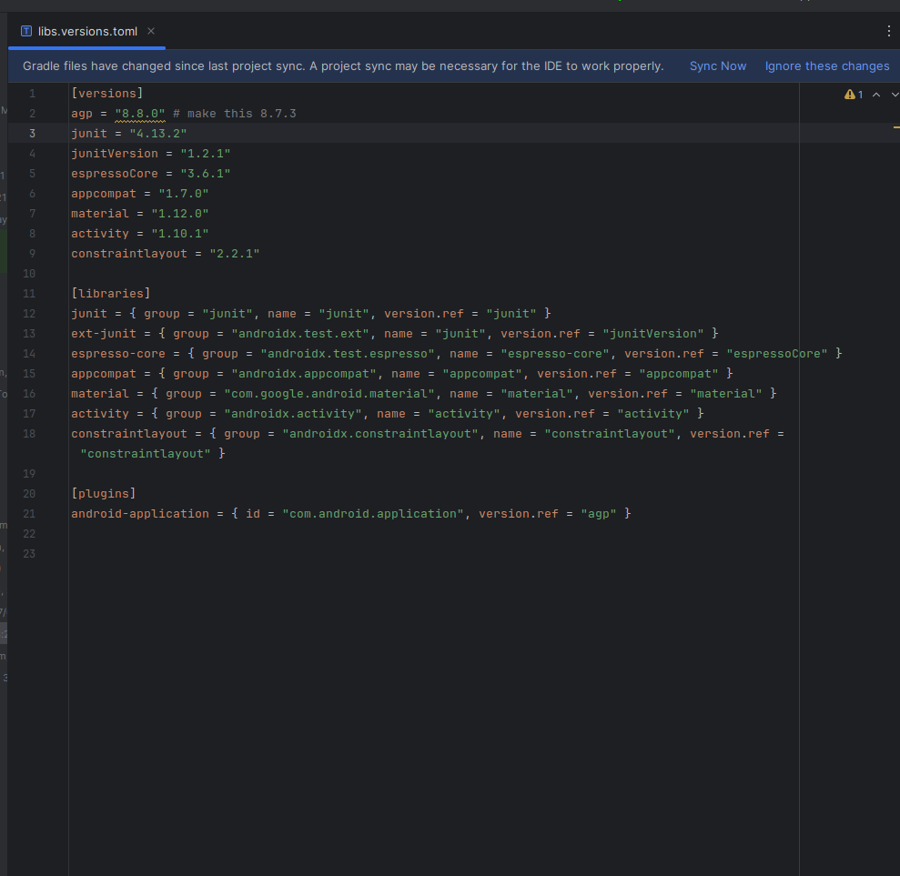
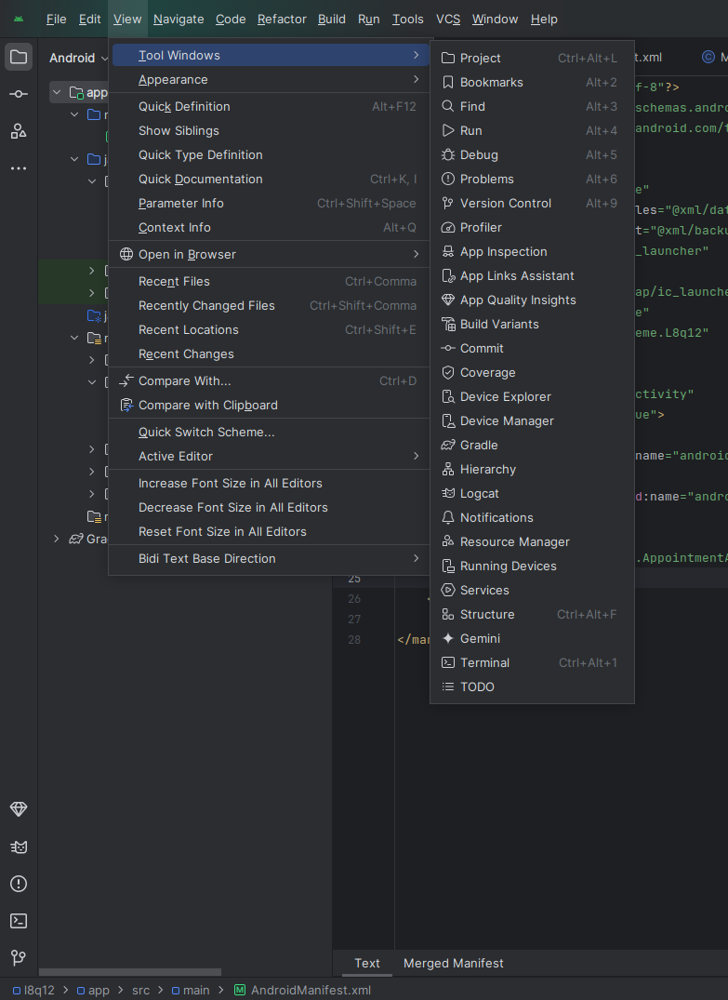
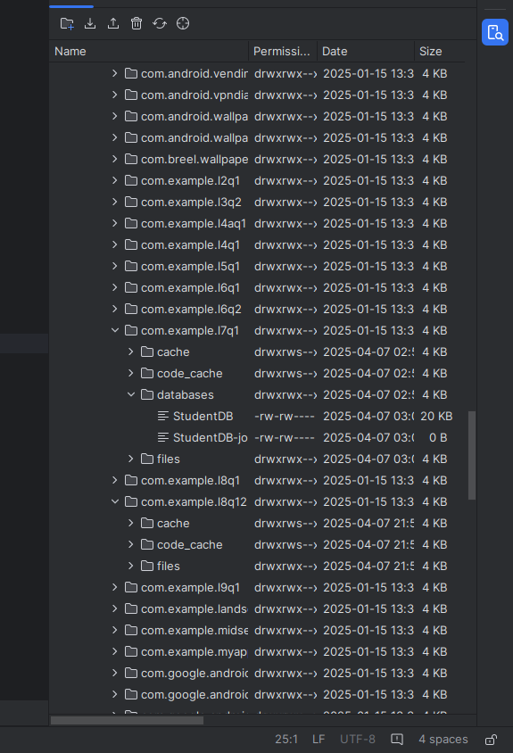
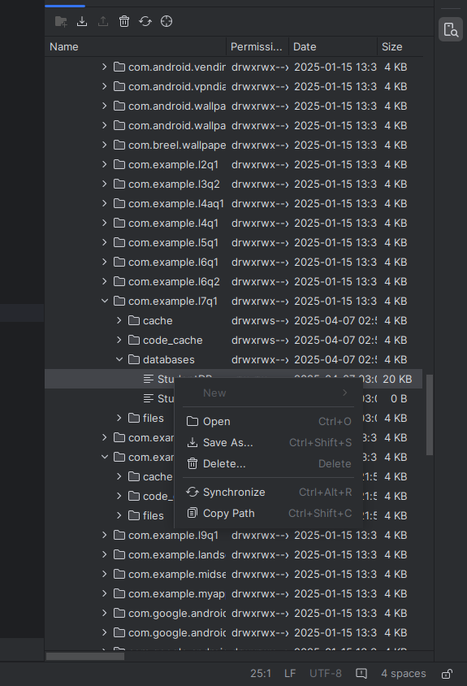

# Advanced Technology Lab

## NOTE
If running in the lab, then go to **Grade Scripts** -> `libs.versions.toml` and change **AGP** under `[versions]` to `8.7.3` from `8.8.0` or greater.

    <figure style="text-align: center; height: 700px;">
        
    </figure>
    

## Steps to Open SQLite DB File in Android Studio

    <figure style="text-align: center; width: 30%; height: 600px;">
        
        <figcaption>Go to <strong>View</strong> -> <strong>Tool Windows</strong> -> <strong>Device Explorer</strong></figcaption>
    </figure>
    <figure style="text-align: center; width: 30%; height: 600px;">
        
        <figcaption>Navigate to <strong>/data</strong> -> <strong>data</strong> -> <code>com.example.project_name</code> -> <strong>databases</strong></figcaption>
    </figure>
    <figure style="text-align: center; width: 30%; height: 600px;">
        
        <figcaption>Either open the <code>.db</code> file with default settings OR save it into a known directory and open using <strong>SQLite Browser</strong></figcaption>
    </figure>

